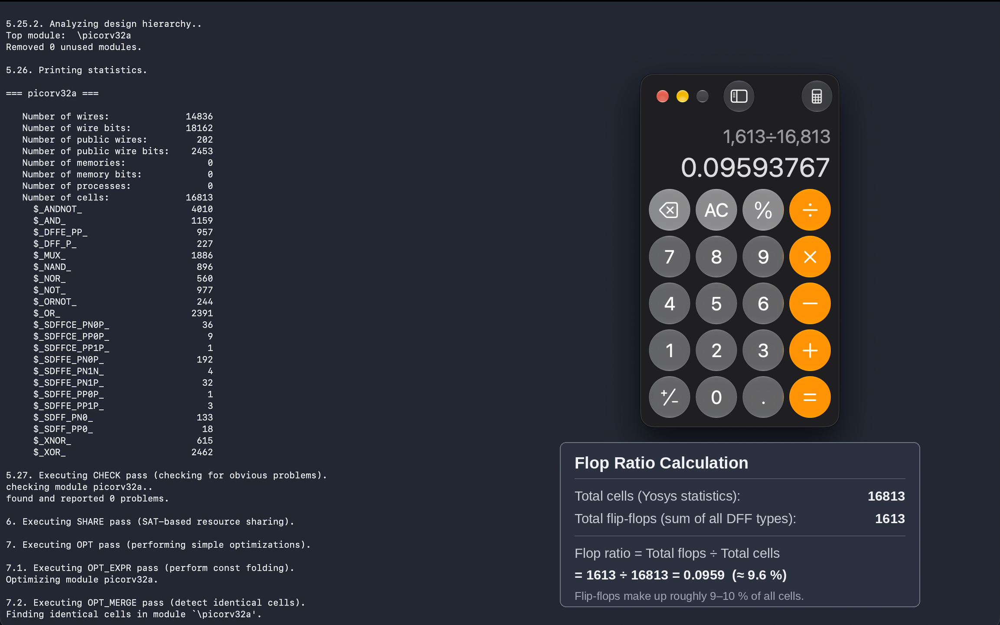

# Synthesis - Picorv32a

This directory documents the synthesis flow and design steps for the `picorv32a` RISC-V core using the **OpenLane** automated RTL-to-GDSII flow and the **Sky130** process design kit (PDK)[cite: 11, 12, 15]. Synthesis is one of the most critical steps in chip design, converting Register-Transfer Level (RTL) descriptions into a gate-level netlist optimized for area, power, and timing.

---

## Workflow 

### 1. Exploring OpenLane Directory Contents

* **Explanation:** Before starting any design run, we inspect the working directory of OpenLane (`openlane_working_dir/openlane`) using the `ls -ltr` command[cite: 12]. This directory contains core scripts, design directories (`designs/`), configuration templates, and flow control scripts (`flow.tcl`) required to run automated ASIC flows.

### 2. Navigating to the Picorv32a Design Directory

* **Explanation:** Inside the `designs/` folder, we navigate specifically into the `picorv32a` project directory[cite: 15]. This directory houses the Verilog source files (`src/`), standard cell library configurations, and the primary project configuration files (`config.tcl`) that define design parameters.

### 3. Reviewing the Main Design Configuration File (`config.tcl`)

* **Explanation:** The `config.tcl` file sets global environment variables for the design[cite: 11]. It defines parameters such as the design name (`picorv32a`), path to Verilog sources and constraints (`sdc_file`), default clock period (5.0 ns), clock port name (`clk`), and sources standard cell specific configurations[cite: 11].

### 4. Reviewing Standard Cell Library Configurations

* **Explanation:** This screenshot shows the standard cell library (`sky130_fd_sc_hd`) specific configuration file[cite: 18]. It sets fine-tuned routing adjustments (`GLB_RT_ADJUSTMENT`), maximum fanout limits (`SYNTH_MAX_FANOUT`), clock periods, core utilization ratios (`FP_CORE_UTIL`), and target placement densities (`PL_TARGET_DENSITY`)[cite: 18].

### 5. Launching OpenLane Interactive Environment

* **Explanation:** We launch the OpenLane environment in interactive mode by running `./flow.tcl -interactive` via Docker[cite: 13]. This opens the Tcl-based command line interface required to execute individual steps of the ASIC design flow manually or step-by-step.

### 6. Inspecting Synthesis Statistics (Yosys Output)

* **Explanation:** During the synthesis phase, **Yosys** analyzes the design hierarchy and reports structural statistics[cite: 20]. This output displays the total number of wires, wire bits, and mapped logic cells (such as `_AND_`, `_OR_`, `_MUX_`, and various flip-flop variants like `_DFFE_` and `_SDFF_`)[cite: 20].

### 7. Calculating the Flop Ratio

* **Explanation:** Using the synthesis statistics, we compute the **Flop Ratio** to evaluate sequential element density[cite: 19]. By dividing the total number of flip-flops (1,613) by the total number of cells (16,813), we find a flop ratio of approximately `0.0959` or **9.6%**, indicating that roughly 9–10% of the synthesized design consists of sequential storage elements[cite: 19].

### 8. Reviewing the Synthesized Netlist

* **Explanation:** This view displays a snippet of the generated gate-level Verilog netlist (`picorv32a.v`) produced by Yosys[cite: 17]. It substitutes behavioral RTL code with actual physical library cells and internal connection wires (`wire _00000_;`, etc.) ready for static timing analysis and placement[cite: 17].

### 9. Checking Synthesis and Timing Report Files

* **Explanation:** Inside the run's report directory (`reports/synthesis/`), we list all generated logs and reports using `ls -ltr`[cite: 16]. This includes Yosys statistics logs (`1-yosys_dff.stat`), check reports, and OpenSTA timing reports (`2-opensta_timing.rpt`, `2-opensta_wns.rpt`, `2-opensta_tns.rpt`)[cite: 16].

### 10. Analyzing OpenSTA Timing Reports

* **Explanation:** The final step involves Static Timing Analysis (STA) performed using OpenSTA[cite: 14]. This report tracks critical path propagation delays, starting from a rising edge-triggered flip-flop clock pin (`clk`), traversing combinatorial logic gates (`_13111_`, `_13112_`, etc.), and arriving at the endpoint to ensure the design meets the target clock frequency without timing violations[cite: 14].

##  Author
- **Name     :** Nukala Shiva Shankar 
- **Roll No. :** 24EG104E28
- **College  :** Anurag University